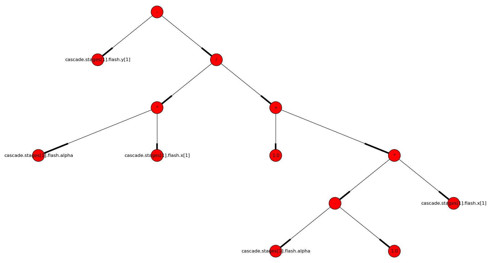

.. sdopt-tearing documentation master file, created by
   sphinx-quickstart on Sat Feb 28 23:04:04 2015.
   You can adapt this file completely to your liking, but it should at least
   contain the root `toctree` directive.

=======================================
Exact and heuristic methods for tearing
=======================================

A demo application is presented on this web-page, showing the capabilities
of the novel tearing algorithms. The technical details will be published in an 
academic paper. The source code of the prototype implementation is `available on
GitHub <https://github.com/baharev/sdopt-tearing>`_ under the 3-clause BSD 
license.

**Software requirements**. The code has been tested with Python 2.7 and 3.4. 
The :mod:`six`, :mod:`networkx`, and :mod:`sympy` packages are necessary; 
:mod:`matplotlib` is recommended but not required. If you wish to run the exact 
algorithms based on integer programming, you will also need `Gurobi 
<http://www.gurobi.com/>`_. If you do not have Gurobi installed, the demo 
application will detect its absence, and simply skips those steps that would 
require the integer programming solver.

--------------------------------------------------------------------------------

.. _spiked-form:

Sparse matrices ordered to spiked form
======================================

Roughly speaking, **tearing algorithms rearrange the rows and the columns of a 
sparse matrix in such a way that the result is "close" to a lower triangular 
matrix.** The picture below shows a sparse matrix ordered to the so-called 
spiked form. The matrix is of size 76x76; this can be reduced to a 5x5 matrix by 
elimination, where 5 equals the number of spike columns, that is, columns with 
red entries. The blue lines correspond to the equipment boundaries in the 
technical system; the tear variables are above the diagonal, and are painted 
red; the gray squares are "forbidden" variables (no explicit elimination 
possible). The elimination is performed along the diagonal.

.. image:: ./pics/SpikedForm.png
   :alt: A sparse matrix ordered to the so-called spiked form.
   :align: center
   :scale: 50%

--------------------------------------------------------------------------------

Steps of the demo application
=============================

You find the source code of the demo application in :file:`demo.py`.

1. Input: flattened Modelica model
----------------------------------

The `Modelica <https://www.modelica.org/>`_ model :file:`data/demo.mo` has 
already been flattened with the `JModelica <http://www.jmodelica.org/>`_ 
compiler by calling :func:`compile_fmux`; check the :mod:`flatten` and 
:mod:`fmux_creator` modules for details. **The demo application takes the 
flattened model as input.** The `OpenModelica Compiler 
<https://openmodelica.org/openmodelicaworld/tools>`_ can also emit the necessary 
XML file, see under *Export > Export XML* in OMEdit.

2. Recovering the process graph
-------------------------------

A directed graph is recovered from the flattened model: The equipments 
correspond to the vertices of the process graph, the edges correspond to the 
material flows. Below is the process graph of a distillation column with
7 stages.

.. image:: ./pics/Cascade.png
   :alt: Digraph representation of a distillation column.
   :align: center
   :scale: 75%

**The process graph is used for partitioning the Jacobian of the system of 
equations:** This is how the blue lines in the :ref:`first picture 
<spiked-form>` were obtained.

At the moment, recovering the directed edges is possible only if the input 
connectors of the equipments are called ``inlet``, and their output connectors 
are called ``outlet``. There is an ongoing discussion with the JModelica 
developers on reconstructing the process graph in a generic way, without 
assuming any naming convention for the connectors.

3. Symbolic manipulation of the equations
-----------------------------------------

The equations are given as binary expression trees in the input file. 
The picture below shows the expression tree for the equation: ::

    y[1] = alpha*x[1]/(1.0+(alpha-1.0)*x[1]).
    

The expression tree of the equations are `symbolically manipulated 
<http://docs.sympy.org/latest/tutorial/manipulation.html>`_  with `SymPy 
<http://www.sympy.org/>`_ to **determine which variables can be explicitly and 
safely eliminated from which equations.** An example for unsafe elimination is 
the rearrangement of ``x*y=1`` to ``y=1/x`` if ``x`` may potentially take on the 
value ``0``. Unsafe eliminations are automatically recognized and avoided; these 
were the gray entries in the :ref:`first picture <spiked-form>`.

4. Optimal tearing
------------------

**There is no clear objective for tearing. A common choice is to minimize the 
size of the final reduced system,** or in other words, to minimize the number of 
spike columns. Although this objective is questionable (it ignores 
numerical stability for example), it nevertheless makes the meaning of optimal 
mathematically well-defined.

If Gurobi is installed, **the Jacobian is ordered optimally with an exact method, 
based on integer programming.** For the same system that was shown in the 
:ref:`first picture <spiked-form>`, we get an optimal ordering that yields a 4x4 
reduced system. The suboptimal ordering shown in the first picture gives a 5x5 
reduced system, and was obtained with the heuristic 
method detailed in the next section. **The integer programming approach does not 
need or use the block structure** which was given with the blue lines in the 
first picture; here the blue lines are absent.

.. image:: ./pics/OptimalTearing.png
   :alt: Optimal tearing, obtained with integer programming.
   :align: center
   :scale: 50%

5. A tearing heuristic exploiting the natural block structure
-------------------------------------------------------------

Technical systems can be partitioned into blocks along the equipment 
boundaries in a fairly natural way. We call this partitioning the 
*natural block structure*. **The implemented tearing heuristic first orders the 
blocks, then the equations within each block.** This is how the 
:ref:`first picture <spiked-form>` with the spiked form was obtained. For your 
convenience, exactly the same picture is shown again below.

.. _OrderingWithBlocks:

.. image:: ./pics/SpikedForm.png
   :alt: Tearing with the block structure.
   :align: center
   :scale: 50%

6. AMPL and Python code generation after tearing
------------------------------------------------

**Our ultimate goal is to reduce a large, sparse system of equations to a small
one.** To this end, `AMPL <http://en.wikipedia.org/wiki/AMPL>`_
code is generated in such a way that the variables can be eliminated as 
desired. After the elimination, **the reduced system has as many variables and 
equations as the number of spike columns.** An AMPL code snippet is shown 
below, generated with the demo application. ::

    # Unit
    # Tears: condenser.divider.zeta (v19)
    eq_14: v14 = v12*v19;  # condenser.divider.outlet[1].f[1] = condenser.divider.inlet[1].f[1]*condenser.divider.zeta
    eq_15: v15 = v13*v19;  # condenser.divider.outlet[1].f[2] = condenser.divider.inlet[1].f[2]*condenser.divider.zeta
    eq_16: v16 = v11*v19;  # condenser.divider.outlet[1].H = condenser.divider.inlet[1].H*condenser.divider.zeta
    eq_17: v17 = v12 - v14;  # condenser.divider.outlet[2].f[1] = condenser.divider.inlet[1].f[1] - condenser.divider.outlet[1].f[1]
    eq_18: v18 = v13 - v15;  # condenser.divider.outlet[2].f[2] = condenser.divider.inlet[1].f[2] - condenser.divider.outlet[1].f[2]
    eq_19: ((v17*32.04)+(v18*60.1))-96.0 = 0;  # ((condenser.divider.outlet[2].f[1]*32.04)+(condenser.divider.outlet[2].f[2]*60.1))-96.0 = 0
    eq_20: v20 = v11 - v16;  # condenser.divider.outlet[2].H = condenser.divider.inlet[1].H - condenser.divider.outlet[1].H
    # Connections
    eq_21: v21 = v20;  # cascade.stages[1].mixer.inlet[1].H = condenser.divider.outlet[2].H
    eq_22: v22 = v17;  # cascade.stages[1].mixer.inlet[1].f[1] = condenser.divider.outlet[2].f[1]
    eq_23: v23 = v18;  # cascade.stages[1].mixer.inlet[1].f[2] = condenser.divider.outlet[2].f[2]
    eq_24: v24 = v16;  # distillateSink.inlet.H = condenser.divider.outlet[1].H
    eq_25: v25 = v14;  # distillateSink.inlet.f[1] = condenser.divider.outlet[1].f[1]
    eq_26: v26 = v15;  # distillateSink.inlet.f[2] = condenser.divider.outlet[1].f[2]

In the above code snippet, equations ``eq_14``--``eq_20`` and variables 
``v14``--``v20`` correspond to :ref:`the third block on the diagonal 
<OrderingWithBlocks>`, starting counting at the top left corner. Variable 
``v19`` corresponds to the spike column of this third block. Equations 
``eq_21``--``eq_26`` and variables ``v21``--``v26`` correspond to the fourth 
diagonal block with only black entries on its diagonal.

**Executable Python code is also generated for evaluating the reduced system.** 
The Pyton code only serves to cross-check correctness.

7. Classic tearing as in the Modelica community
------------------------------------------------

8. Tearing heuristics that resemble the minimum-degree ordering
---------------------------------------------------------------

9. Tearing in the chemical engineering literature
-------------------------------------------------

.. image:: ./pics/MFES.png
   :alt: Minimum Feedback Edge Set (MFES).
   :align: center
   :scale: 50%

--------------------------------------------------------------------------------

Future work
===========

Improving numerical stability
-----------------------------

**Tearing can yield small but very ill-conditioned systems**; as a consequence, 
the final reduced systems can be notoriously difficult or even impossible to 
solve. **Our recent publications** `[1] <http://dx.doi.org/10.1002/aic.14305>`_ 
**and** `[2] <http://www.mat.univie.ac.at/%7Eneum/ms/maniSol.pdf>`_  **show how 
this well-known numerical issue of tearing can be resolved.** The cost of the 
improved numerical stability is the significantly increased computation time. 
Our pilot Java implementation has shown that it is crucial
    
  - to design a convenient API for subproblem selection (roughly speaking: 
    to be able to work with arbitrary number of diagonal blocks), 
    
  - to generate C++ source code for efficient evaluation of the subproblems
    (the residual and the Jacobian of the blocks),
    
  - that the generated source code works with user-defined data types.

The next item on the agenda is to create a Python prototype implementation that 
meets all these requirements.

Source code generation for reverse mode automatic differentiation
-----------------------------------------------------------------

The Jacobian is required when solving the subproblems with a solver like `IPOPT 
<https://projects.coin-or.org/Ipopt>`_. I am not aware of any `automatic 
differentiation <http://en.wikipedia.org/wiki/Automatic_differentiation>`_ 
package that would fulfill all the requirements listed above, so I have set out 
to write my own. The primary challenge is to design an API that makes it easy to 
work with subproblems, and that makes the interfacing with various solvers only 
moderately painful. Generating source code for evaluating the Jacobian of the 
subproblems is certainly not the main difficulty here.

The diagonal blocks of the Jacobian will be obtained with reverse mode automatic
differentiation. For example, for the expression ::

    exp(3*x+2*y)+4*z 

the following Python code is generated (hand-edited to improve readability) ::

    # f = exp(3*x+2*y)+z
    # Forward sweep
    t1 = 3.0*x + 2.0*y
    t2 = exp(t1)
    f = 4.0*z + t2 - 1.0
    # Backward sweep
    u0 = 1.0
    u1 = 4.0 * u0  # df/dz = 4
    u2 = u0
    u3 = t2 * u2
    u4 = 3.0 * u3  # df/dx = 3*exp(3*x+2*y)
    u5 = 2.0 * u3  # df/dy = 2*exp(3*x+2*y)

**This code is already automatically generated today** with 
the sibling package `SDOPT <https://sdopt.readthedocs.org>`_.

The templated C++ version of this code will greatly benefit from code 
optimization performed by the C++ compiler, especially from `constant folding 
and constant propagation <http://en.wikipedia.org/wiki/Constant_folding>`_. 
I expect the generated assembly code to be as good as hand-written.

--------------------------------------------------------------------------------

.. toctree::
   :maxdepth: 2

Indices and tables
==================

* :ref:`genindex`
* :ref:`modindex`
* :ref:`search`

