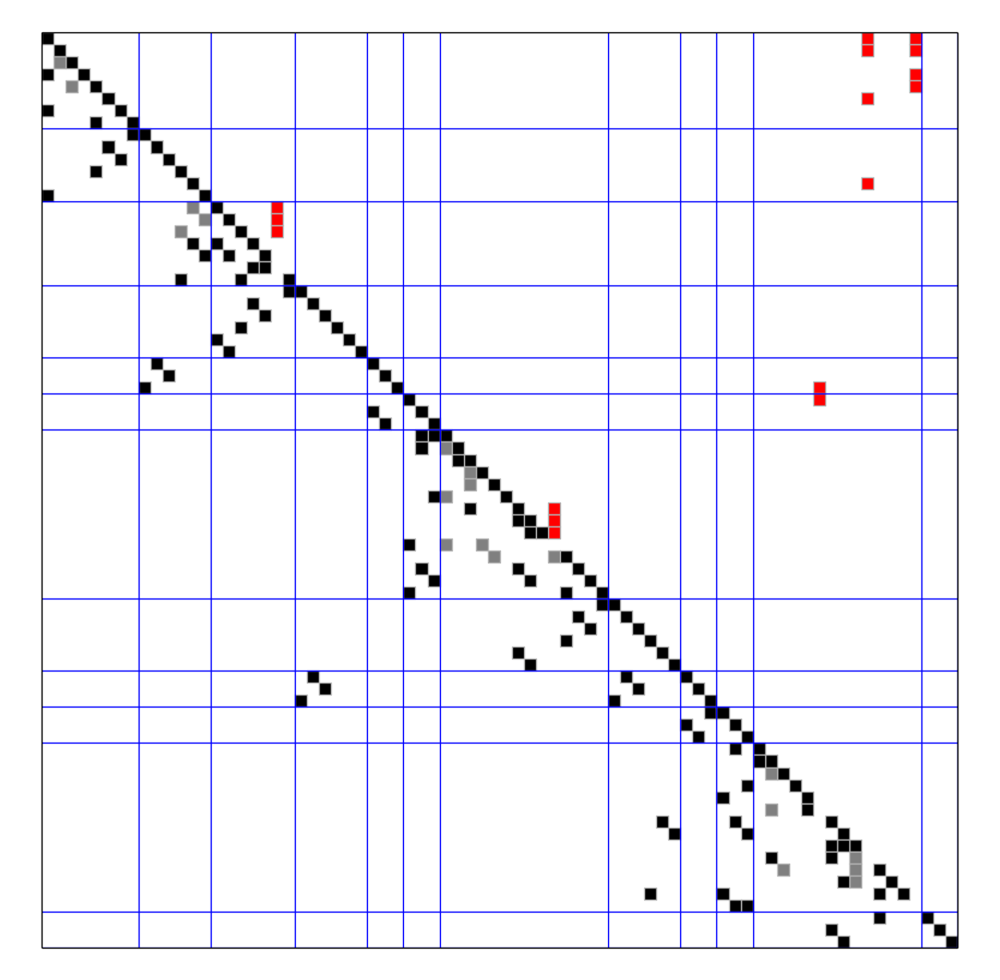
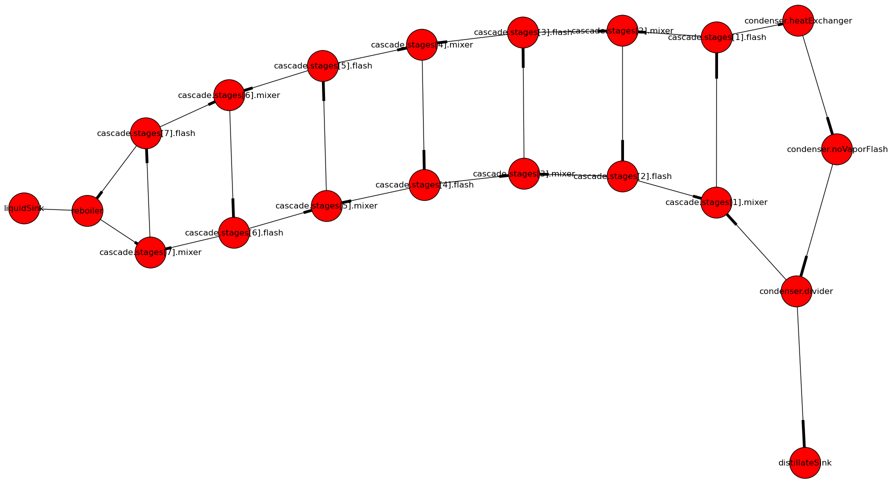
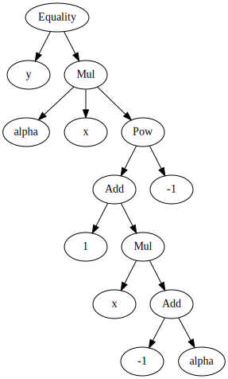
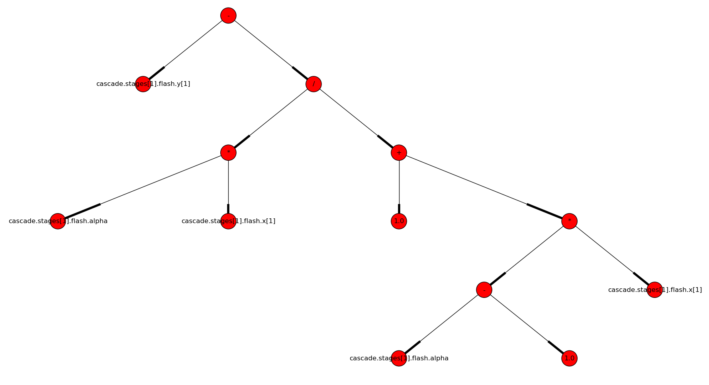
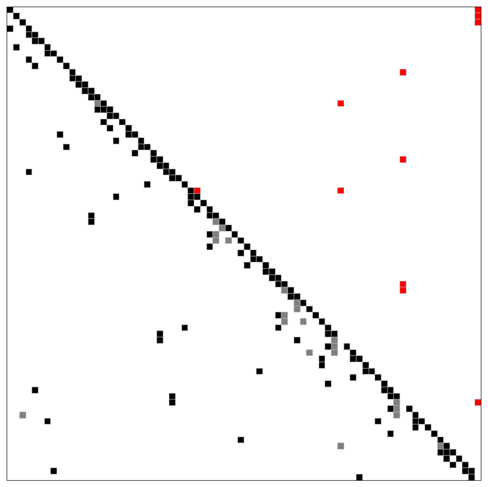
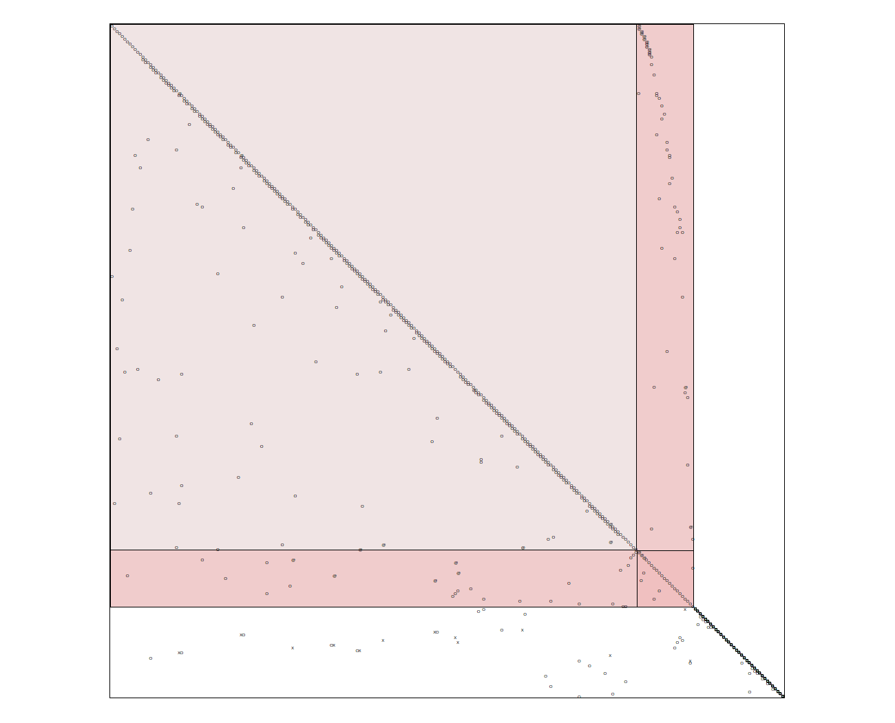
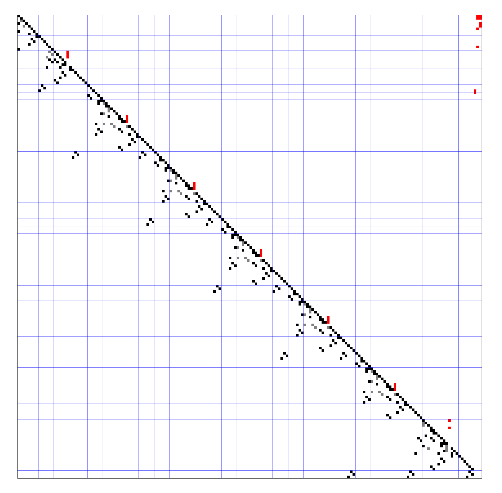
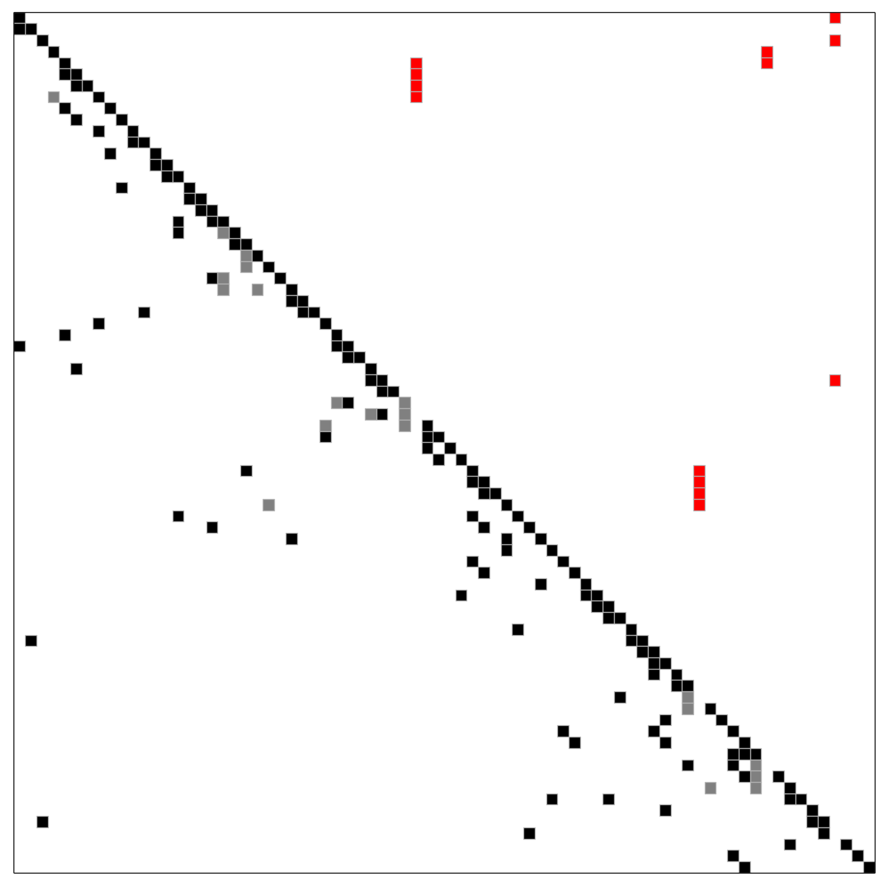
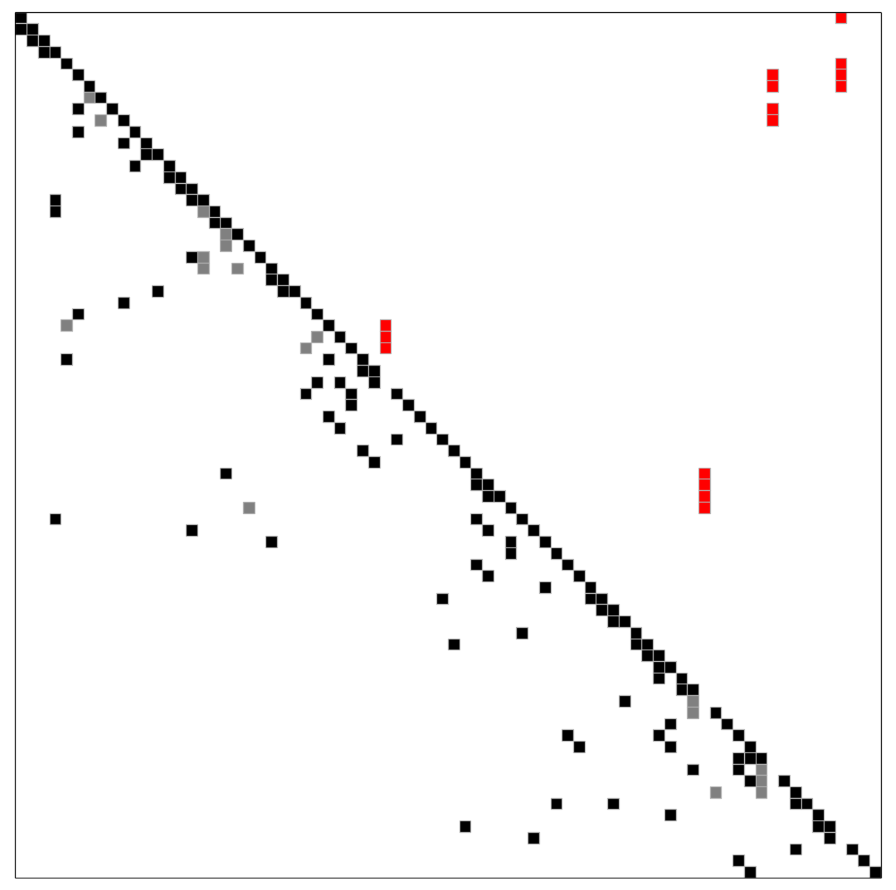
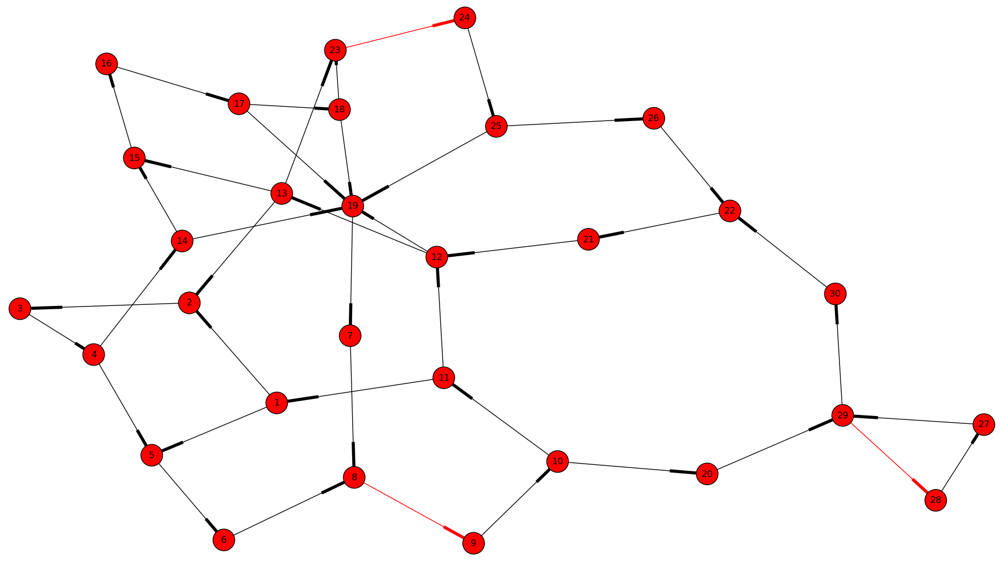

.. sdopt-tearing documentation master file, created by
   sphinx-quickstart on Sat Feb 28 23:04:04 2015.
   You can adapt this file completely to your liking, but it should at least
   contain the root `toctree` directive.

=======================================
Exact and heuristic methods for tearing
=======================================

Many of the implemented algorithms are described in the following academic 
papers (submitted, only drafts are available on these links):

  - `An exact method for the minimum feedback arc set problem <http://reliablecomputing.eu/baharev_minimum_feedback_arc_set.pdf>`_
  - `Tearing systems of nonlinear equations I. A survey <http://reliablecomputing.eu/baharev_tearing_survey.pdf>`_
  - `Tearing systems of nonlinear equations II. A practical exact algorithm <http://reliablecomputing.eu/baharev_tearing_exact_algorithm.pdf>`_

See also `Reproducing the results of the academic papers <https://github.com/baharev/sdopt-tearing#reproducing-the-results-of-minimum-feedback-arc-set-paper>`_.

The source code of the prototype implementation is 
`available on GitHub <https://github.com/baharev/sdopt-tearing#exact-and-heuristic-methods-for-tearing>`_ 
under the 3-clause BSD license. The code is a work in progress. Some of the code
will be contributed back to 
`NetworkX <http://networkx.github.io/documentation/latest/overview.html>`_
wherever it is appropriate. The remaining part of the code will be released as a 
Python package on PyPI.  In the meantime, the :file:`rpc_api.py` is a good place 
to start looking. (:file:`rpc` stands for remote procedure call; it can be 
called from Java or C++ through the :file:`json_io.py`) The API in 
:file:`rpc_api.py` takes a sparse matrix in coordinate format and returns the 
row and column permutation vectors. As for the rest of this web-page, a demo 
application :file:`demo.py` is presented here, showing the capabilities of the 
novel tearing algorithms.

--------------------------------------------------------------------------------

.. _spiked-form:

Sparse matrices ordered to spiked form
======================================

Roughly speaking, **tearing algorithms rearrange the rows and the columns of a 
sparse matrix in such a way that the result is "close" to a lower triangular 
matrix.** A sparse matrix ordered to the so-called spiked form is shown in the 
picture below. The matrix is of size 76x76; it can be reduced to a 5x5 matrix by 
elimination, where 5 equals the number of spike columns, that is, columns with 
red entries. The blue lines correspond to the device boundaries in the 
technical system; the tear variables are above the diagonal, and are painted 
red; the gray squares are "forbidden" variables (no explicit elimination 
possible). The elimination is performed along the diagonal.

   
   A sparse matrix ordered to the so-called spiked form

--------------------------------------------------------------------------------

Steps of the demo application
=============================

You find the source code of the demo application in :file:`demo.py`.

1. Input: flattened Modelica model
----------------------------------

The `Modelica <https://www.modelica.org/>`_ model :file:`data/demo.mo` has 
already been flattened with the `JModelica <http://www.jmodelica.org/>`_ 
compiler by calling :func:`compile_fmux`; check the :mod:`flatten` and 
:mod:`fmux_creator` modules for details. **The demo application takes the 
flattened model as input.** The `OpenModelica Compiler 
<https://openmodelica.org/openmodelicaworld/tools>`_ can also emit the necessary 
XML file, see under *Export > Export XML* in OMEdit; unfortunately, it is 
unclear how to disable alias variable elimination and tearing in this compiler.

--------------------------------------------------------------------------------

2. Recovering the process graph
-------------------------------

A directed graph is recovered from the flattened model: **The devices 
correspond to the vertices of the process graph, the edges correspond to the 
material flows.**

   The process graph of a distillation column with 7 stages (click on the image
   to enlarge it)

**The process graph is used for partitioning the Jacobian of the system of 
equations:** This is how the blue lines in the :ref:`first picture 
<spiked-form>` were obtained.

.. _inlet-outlet-naming-convention:

At the moment, recovering the directed edges is possible only if the input 
connectors of the devices are called ``inlet``, and their output connectors 
are called ``outlet``. There is an ongoing discussion with the JModelica 
developers on reconstructing the process graph in a generic way, without 
assuming any naming convention for the connectors.

--------------------------------------------------------------------------------

3. Symbolic manipulation of the equations
-----------------------------------------

The equations are given as binary expression trees in the input flattened 
Modelica model.

   
   The expression tree of ``y = alpha*x/(1+(alpha-1)*x)`` in SymPy

   
   The same expression tree of ``y = alpha*x/(1+(alpha-1)*x)``) 
   but as a NetworkX DiGraph

The expression trees of the equations are `symbolically manipulated 
<http://docs.sympy.org/latest/tutorial/manipulation.html>`_  with `SymPy 
<http://www.sympy.org/>`_ to **determine which variables can be explicitly and 
safely eliminated from which equations.** An example for unsafe elimination is 
the rearrangement of ``x*y=1`` to ``y=1/x`` if ``x`` may potentially take on the 
value ``0``. Unsafe eliminations are automatically recognized and avoided; these 
were the gray entries in the :ref:`first picture <spiked-form>`.

--------------------------------------------------------------------------------

4. Optimal tearing
------------------

**There is no clear objective for tearing. A common choice is to minimize the 
size of the final reduced system,** or in other words, to minimize the number of 
spike columns. Although this objective is questionable (it ignores numerical 
stability for example), it nevertheless makes the meaning of optimal 
mathematically well-defined.

If Gurobi is installed, **the Jacobian is ordered optimally with an exact 
method, based on integer programming.** For the same system that was shown in 
the :ref:`first picture <spiked-form>`, we get an optimal ordering that yields a 
4x4 reduced system. The suboptimal ordering shown in the first picture gives a 
5x5 reduced system, and was obtained with the heuristic method detailed in the 
next section. **The integer programming approach does not need or use the block 
structure** which was given with the blue lines in the first picture; here the 
blue lines are absent.

   
   Optimal order, obtained with integer programming

Note that the first spike is the red entry right above the diagonal.
   
--------------------------------------------------------------------------------

.. _natural-block-structure:

5. A hierarchical tearing heuristic exploiting the natural block structure
--------------------------------------------------------------------------

Technical systems can be partitioned into blocks along the device boundaries 
in a fairly natural way. We call this partitioning the *natural block 
structure*. **The implemented tearing heuristic first orders the blocks, then 
the equations within each block.** This is how the :ref:`first picture 
<spiked-form>` with the spiked form was obtained. Exactly the same picture is 
shown below for your convenience.

.. _OrderingWithBlocks:

   
   Hierarchical tearing with the natural block structure

Further details are discussed in 
`Tearing systems of nonlinear equations I. A survey <http://reliablecomputing.eu/baharev_tearing_survey.pdf>`_
under *7.3. Hierarchical tearing*.

.. _tearing-in-Modelica:

5.1 Tearing as seen in Modelica tools
~~~~~~~~~~~~~~~~~~~~~~~~~~~~~~~~~~~~~

First, the undirected bipartite graph representation of the system of equations 
is oriented with `matching <http://en.wikipedia.org/wiki/Matching_%28graph_theory%29>`_;
in other words, the undirected graph is made directed. Then, the strongly 
connected components (SCC) of this directed graph are identified. This way of 
identifying the SCCs is also referred to as **block lower triangular 
decomposition (BLT decomposition)** or Dulmage-Mendelsohn decomposition. **After 
finishing the BLT decomposition, a subset of the edges is torn within each SCC to 
make them acyclic.** Greedy heuristics, for example 
`variants of Cellier's heuristic <http://dx.doi.org/10.1145/2666202.2666204>`_, 
are used to find a tear set with small cardinality. This approach can produce 
unsatisfactory results if the system has large strongly connected components. 
An example is shown below.

   
   Tearing obtained from JModelica with `generate_html_diagnostics` (click to enlarge)
    
As it can be seen in this picture, the BLT decomposition gave one large block. 
This is not surprising, as the example is a distillation column. The border 
width of the largest block (the number of torn variables) is proportional to the 
size of the column. For a realistic column, this can become problematic.

However, if the :ref:`natural block structure <natural-block-structure>` is used 
for partitioning as discussed above, the number of torn variables (the border 
width) does not change with the size of the column. We get the following picture 
for exactly the same input.

   
   Hierarchical tearing with the natural block structure (click to enlarge)

The first spike belongs to the condenser, then the next 5 spikes correspond to 
the 5 stages of the distillation column, and the reboiler comes last. **The 
number of variables on the right border (3 spikes in this example) remains 
independent of the size of the column.**

--------------------------------------------------------------------------------

6. AMPL and Python code generation after tearing
------------------------------------------------

**Our ultimate goal is to reduce a large, sparse system of equations to a small
one.** To this end, `AMPL <http://en.wikipedia.org/wiki/AMPL>`_
code is generated in such a way that the variables can be eliminated as 
desired. After the elimination, **the reduced system has as many variables and 
equations as the number of spike columns.** An AMPL code snippet is shown 
below, generated with the demo application. ::

    # Block
    # Tears: condenser.divider.zeta (v19)
    eq_14: v14 = v12*v19;  # condenser.divider.outlet[1].f[1] = condenser.divider.inlet[1].f[1]*condenser.divider.zeta
    eq_15: v15 = v13*v19;  # condenser.divider.outlet[1].f[2] = condenser.divider.inlet[1].f[2]*condenser.divider.zeta
    eq_16: v16 = v11*v19;  # condenser.divider.outlet[1].H = condenser.divider.inlet[1].H*condenser.divider.zeta
    eq_17: v17 = v12 - v14;  # condenser.divider.outlet[2].f[1] = condenser.divider.inlet[1].f[1] - condenser.divider.outlet[1].f[1]
    eq_18: v18 = v13 - v15;  # condenser.divider.outlet[2].f[2] = condenser.divider.inlet[1].f[2] - condenser.divider.outlet[1].f[2]
    eq_19: ((v17*32.04)+(v18*60.1))-96.0 = 0;  # ((condenser.divider.outlet[2].f[1]*32.04)+(condenser.divider.outlet[2].f[2]*60.1))-96.0 = 0
    eq_20: v20 = v11 - v16;  # condenser.divider.outlet[2].H = condenser.divider.inlet[1].H - condenser.divider.outlet[1].H
    # Connections
    eq_21: v21 = v20;  # cascade.stages[1].mixer.inlet[1].H = condenser.divider.outlet[2].H
    eq_22: v22 = v17;  # cascade.stages[1].mixer.inlet[1].f[1] = condenser.divider.outlet[2].f[1]
    eq_23: v23 = v18;  # cascade.stages[1].mixer.inlet[1].f[2] = condenser.divider.outlet[2].f[2]
    eq_24: v24 = v16;  # distillateSink.inlet.H = condenser.divider.outlet[1].H
    eq_25: v25 = v14;  # distillateSink.inlet.f[1] = condenser.divider.outlet[1].f[1]
    eq_26: v26 = v15;  # distillateSink.inlet.f[2] = condenser.divider.outlet[1].f[2]

In the above code snippet, equations ``eq_14``--``eq_20`` and variables 
``v14``--``v20`` correspond to :ref:`the third block on the diagonal 
<OrderingWithBlocks>`, starting counting at the top left corner. Variable 
``v19`` corresponds to the spike column of this third block. Equations 
``eq_21``--``eq_26`` and variables ``v21``--``v26`` correspond to the fourth 
diagonal block with only black entries on its diagonal.

**Executable Python code is also generated for evaluating the reduced system.** 
The Python code only serves to cross-check correctness.

--------------------------------------------------------------------------------

7. A greedy tearing heuristic
-----------------------------

**A greedy tearing heuristic has been implemented, inspired by** `algorithm 
(2.3) of Fletcher and Hall <http://dx.doi.org/10.1007/BF02025533>`_. The 
heuristic resembles the `minimum degree algorithm 
<http://en.wikipedia.org/wiki/Minimum_degree_algorithm>`_, but it also works for 
highly unsymmetric matrices. The implemented heuristic does not need or use any 
block structure. When breaking ties in the greedy choice, **a lookahead step can 
improve the quality of the ordering**.

   
   Spiked form obtained with the greedy tearing heuristic, no lookahead

There are five spikes without lookahead: The gray entry on the diagonal also 
counts as a spike.

   
   Spiked form obtained with the greedy tearing heuristic, happens to be optimal
   with lookahead

--------------------------------------------------------------------------------

8. Tearing in chemical engineering
----------------------------------

..
    When a professional chemical engineering simulator is run in sequential modular 
    (SM) mode, the output of a device is quickly computed from its input with a 
    numerical method specialized for that particular device. However,
    computing the input of a device given its output can be computationally 
    demanding because the specialized method was optimized for the . Therefore, 
    the goal of tearing in this case is to minimize the number of devices for 
    which the input has to be computed from the output.

**In abstract terms, this kind of tearing is equivalent to the** `minimum 
feedback arc set (MFAS) problem 
<http://en.wikipedia.org/wiki/Feedback_arc_set>`_, the complement problem
is known as the **maximum acyclic subgraph problem**. 
Compared to :ref:`the tearing methods of Modelica tools <tearing-in-Modelica>`, 
the differences are: (1) the graph is already oriented (directed), and 
(2) the nodes of the graph correspond to small systems of equations in the 
MFAS problem.

   
   The 3 red edges form a minimum feedback arc set of the directed graph

**Both a greedy heuristic and an exact algorithm has been implemented to solve
the feedback arc set problem for weighted directed graphs.**

--------------------------------------------------------------------------------

Future work
===========

Establishing a benchmark suite
------------------------------

Finding the optimal solution to tearing is NP-complete and approximation 
resistant. Therefore, **a comprehensive benchmark suite has to be established,**
and then the various heuristics can be evaluated to see which one works well in 
practice. `The COCONUT benchmark suite 
<http://www.mat.univie.ac.at/~neum/glopt/coconut/Benchmark/Benchmark.html>`_ 
will be used for evaluating heuristics that do not require the natural block 
structure. **I hope to receive help from the Modelica community to establish a 
test set** where the :ref:`natural block structure <natural-block-structure>` is 
available. Dr.-Ing. Michael Sielemann (Technical Director for Aeronautics and 
Space at `Modelon Deutschland GmbH <http://www.modelon.com/>`_) has already 
offered his kind help.

--------------------------------------------------------------------------------

Integration into Modelica tools
-------------------------------

The implemented algorithms should be integrated into state-of-the-art Modelica 
tools. At the moment, **a major obstacle is the inability to recover the process 
graph in the general case,** as discussed above at the 
:ref:`naming convention workaround <inlet-outlet-naming-convention>`.

--------------------------------------------------------------------------------

Improving numerical stability
-----------------------------

**Tearing can yield small but very ill-conditioned systems**; as a consequence, 
the final reduced systems can be notoriously difficult or even impossible to 
solve. **Our recent publications** `[1] <http://dx.doi.org/10.1002/aic.14305>`_ 
**and** `[2] <http://reliablecomputing.eu/baharev_manifold_based_starting_points.pdf>`_  
**show how this well-known numerical issue of tearing can be resolved.** The cost of the 
improved numerical stability is the significantly increased computation time. 

.. _handling-subproblems:

Our pilot Java implementation has shown that it is crucial
    
  - to design a convenient API for subproblem selection (roughly speaking: 
    to be able to work with arbitrary number of diagonal blocks, ordered
    sequentially), 
    
  - to generate C++ source code for efficient evaluation of the subproblems
    (the residual and the Jacobian of the blocks),
    
  - that the generated source code works with user-defined data types 
    (and C++ templates do).

The next item on the agenda is to create a Python prototype implementation that 
meets all these requirements.

--------------------------------------------------------------------------------

Source code generation for reverse mode automatic differentiation
-----------------------------------------------------------------

The Jacobian is required when solving the subproblems with a solver like `IPOPT 
<https://projects.coin-or.org/Ipopt>`_.
**Generating C++ source code for evaluating the Jacobian of the subproblems is 
certainly not the main difficulty here:** The primary challenge is to design an 
API that makes it easy to work with subproblems, and that makes the interfacing 
with various solvers only moderately painful.

**I am not aware of any** `automatic 
differentiation <http://en.wikipedia.org/wiki/Automatic_differentiation>`_ 
**package that would fulfill the requirements** :ref:`listed above 
<handling-subproblems>`, so I have set out to write my own. The diagonal blocks 
of the Jacobian will be obtained with reverse mode automatic differentiation. 
For example, for the expression ::

    exp(3*x+2*y)+4*z 

the following Python code is generated (hand-edited to improve readability) ::

    # f = exp(3*x+2*y)+z
    # Forward sweep
    t1 = 3.0*x + 2.0*y
    t2 = exp(t1)
    f = 4.0*z + t2 - 1.0
    # Backward sweep
    u0 = 1.0
    u1 = 4.0 * u0  # df/dz = 4
    u2 = u0
    u3 = t2 * u2
    u4 = 3.0 * u3  # df/dx = 3*exp(3*x+2*y)
    u5 = 2.0 * u3  # df/dy = 2*exp(3*x+2*y)

**This code was automatically generated** with 
the sibling package `SDOPT <https://sdopt.readthedocs.org>`_.

The templated C++ version of this code will greatly benefit from code 
optimization performed by the C++ compiler, especially from `constant folding 
and constant propagation <http://en.wikipedia.org/wiki/Constant_folding>`_. 
I expect the generated assembly code to be as good as hand-written.

--------------------------------------------------------------------------------

..
    .. toctree::
    :maxdepth: 2

Indices and tables
==================

* :ref:`genindex`
* :ref:`modindex`
* :ref:`search`

